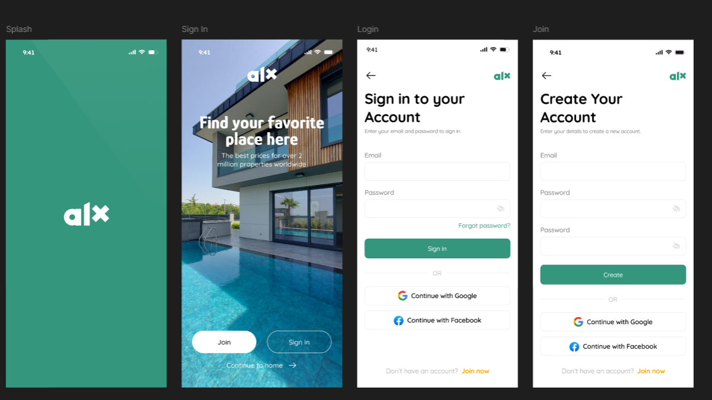

# Wireframing 
## Brief Overview
A wireframe can be as simple as a sketch. 

Just like a recipe before cooking a delicious meal or a blueprint an architect uses before building a house, a wireframe helps you visualize the content, structure, and overall flow of your website before you start building.

You can start simple using hand-drawn wireframes using pen and paper (the fastest way to get your ideas down). Then move to digital wireframes, which are easier to share with your team or clients.

> **Importance of creating a wireframe before jumping into building a website**  
>  
> Helps you to gather feedback early 
> Saves you time and effort down the road
> Boost creativity as you can freely try out different ideas
> Effective planning and costing.

## Key Elements of Wireframing
### Layout Structure
This is basically how you organize your page. It's the overall arrangement of sections like headers, sidebars, and footers. For example, deciding if your homepage has a big hero image at the top or a grid of product cards helps determine how users will scan your page.

### Navigation
This shows how people will move around your site. Things like menus, search bars, and breadcrumbs help users find what they need. Good navigation in your wireframe might show that users can get from the homepage to any product page in just two clicks.

### Content Placement
This is figuring out where text, images, buttons, and forms go. For instance, putting your most important info "above the fold" (visible without scrolling) makes sure users see it right away. Your wireframe might show where product descriptions go versus where product images appear.

### Functionality
This covers the interactive parts - what happens when someone clicks a button or fills out a form. In your wireframe, you might show dropdown menus, accordions that expand, or pop-up windows that appear after certain actions.

## Types of Wireframes
| **Wireframe Type**       | **Description**                                                                                                                                                             | **Best Used When**                                                                                                            | **Benefits**                                                                                   |
|--------------------------|-----------------------------------------------------------------------------------------------------------------------------------------------------------------------------|--------------------------------------------------------------------------------------------------------------------------------|------------------------------------------------------------------------------------------------|
| **Low-Fidelity Wireframes**  | Basic sketches focused on layout and structure. Often hand-drawn or made with simple digital tools.                                                                        | - You're brainstorming ideas    - Need to quickly test different layouts   - Early feedback sessions                      | - Super quick to create   - Easy to discard and iterate   - Helps capture initial ideas without focusing on details |
| **High-Fidelity Wireframes** | More detailed and closer to the final product. Includes accurate layout, real content, and basic visuals like buttons or shading.                                            | - After settling on a layout   - When more detailed feedback is needed   - Before full mockups   - For stakeholder communication | - Offers a clearer picture of the final product   - Helps with detailed feedback   - Easier for non-designers to understand |

### Example
<figure>
  
  <figcaption><em>Figure 1:</em> High-fidelity wireframe (Mobile View) with more detailed layout and visual elements.</figcaption>
</figure>

## Popular Wireframing Tools
There are several tools available for creating both low- and high-fidelity wireframes. Each comes with its own strengths depending on your workflow, collaboration needs, and level of detail required. Here are a few commonly used ones:

| Tool        | Description                                                                                  |
|-------------|----------------------------------------------------------------------------------------------|
| Figma   | A cloud-based design tool perfect for wireframing, prototyping, and collaboration in real time. |
| Balsamiq    | Great for low-fidelity wireframes with a sketchy look, emphasizing layout over visuals.     |
| Adobe XD    | Ideal for high-fidelity wireframes and interactive prototypes, especially for Adobe users.  |
| Sketch      | A macOS-only tool widely used for UI/UX design, with strong support for wireframing plugins.|
| Whimsical   | Combines wireframing, flowcharts, and sticky notes — good for brainstorming and fast ideation. |

### Recommended: Figma

Figma stands out as a go-to tool for many designers and developers, especially for teams.

- **Cloud-based**: Access your projects from anywhere — no need to install anything.
- **Real-time collaboration**: Multiple people can work on the same file simultaneously.
- **Component system**: Reuse elements like buttons and input fields to maintain consistency.
- **Prototyping features**: Create interactive mockups directly within the figma.
- **Browser-friendly**: Works smoothly right in your browser, with optional desktop apps.

> You can try it for free at [figma.com](https://figma.com).

## Why Wireframing Matters in Software Development

1. **Clarifies Structure Before Coding**

Wireframes help define the **layout and user flow** before diving into actual development. A low-fidelity sketch, for example, allows teams to agree on where navigation, buttons, and content blocks should go — without wasting time on premature details.

2. **Speeds Up Decision Making**

By separating **function from visuals**, wireframes allow faster iteration and clearer decision-making. Teams can quickly test different layouts, remove ineffective ideas, and move forward with confidence.

3. **Reduces Miscommunication and Rework**

Wireframes act as a **blueprint**. Developers know what to build. Designers know what to refine. Stakeholders know what to expect.

## Real-World Scenario: Catching Usability Issues Early

### Scenario: Designing a Mobile Checkout Flow

A product team was working on a mobile e-commerce app and began the process with a **low-fidelity wireframe** of the checkout screen. The wireframe included form fields for shipping details, payment info, and a “Place Order” button at the bottom.

During a feedback session with the UX team and a few non-technical stakeholders, a critical issue was flagged: **the form looked overwhelming on a small screen**. All fields were stacked vertically, making the checkout experience feel long and tedious — especially on older phones with limited screen space.

### Resolution

Instead of moving forward to high-fidelity designs or code, the team:

- **Reorganized the layout** in the wireframe using collapsible sections (e.g., "Shipping Info" and "Payment Details").
- Added a **progress indicator** to give users a sense of completion.
- Ran a quick usability test using a revised high-fidelity wireframe in Figma.

These changes made the process feel **shorter and more intuitive**, reducing perceived friction during checkout.

### Impact on the Final Product

By identifying and resolving this issue early in the wireframing stage:

- Development avoided unnecessary rework or code changes.
- The team delivered a cleaner, more user-friendly experience.
- Conversion rates during checkout improved after launch.

---

### ✅ Conclusion: The Role of Wireframing

This scenario highlights how wireframing helps teams **spot usability problems early**, long before a single line of code is written. It fosters fast iteration, improves communication, and results in a product that feels intentional and user-centered. Whether you’re sketching on paper or building interactive mockups in Figma, wireframing is one of the smartest ways to build better software.
